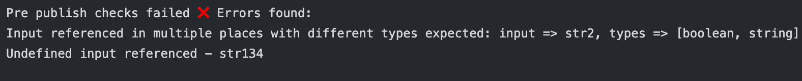

# stacks-pre-publish
## TL;DR
Add this YAML to get run the tests. Checks output in the logs.
```yaml
name: Run Pre Publish and Release stacks
on: [push]
jobs:
  Explore-GitHub-Actions:
    runs-on: ubuntu-latest
    steps:
      - uses: sundargs2000/stacks-pre-publish@v0
```

## About
This composite action let's you run the pre-publish checks on stacks that you currently see during release. 

You can use the output of this action to create releases as well, as shown in the below snippet. Theres no need to checkout the stack repo since this action automatically does it.

```yaml
name: Run Pre Publish and Release stacks
on: [push]
jobs:
  Explore-GitHub-Actions:
    runs-on: ubuntu-latest
    steps:
      - id: prepublish
        uses: sundargs2000/stacks-pre-publish@v0
          
      - name: Create Release
        if: ${{ steps.prepublish.outputs.success == 'true' }}
        uses: actions/create-release@v1
        env:
          GITHUB_TOKEN: ${{ secrets.GITHUB_TOKEN }} # This token is provided by Actions, you do not need to create your own token
        with:
          tag_name: v1.${{ github.ref }}
          release_name: Release stack/${{ github.ref }}
```

## Context

Currently the pre-publish checks is a black box.

We have plans to add authoring experiences, until then this action can be used to run the tests if you are stuck and unable to figure out what's wrong with your template. You would see a log like this:


Currently maintaining this action and plan to keep it up to date with the changes we make. Please reach out to me if you find any issues or have suggestions. It isn't really complete yet (there aren't even tests 😛).
